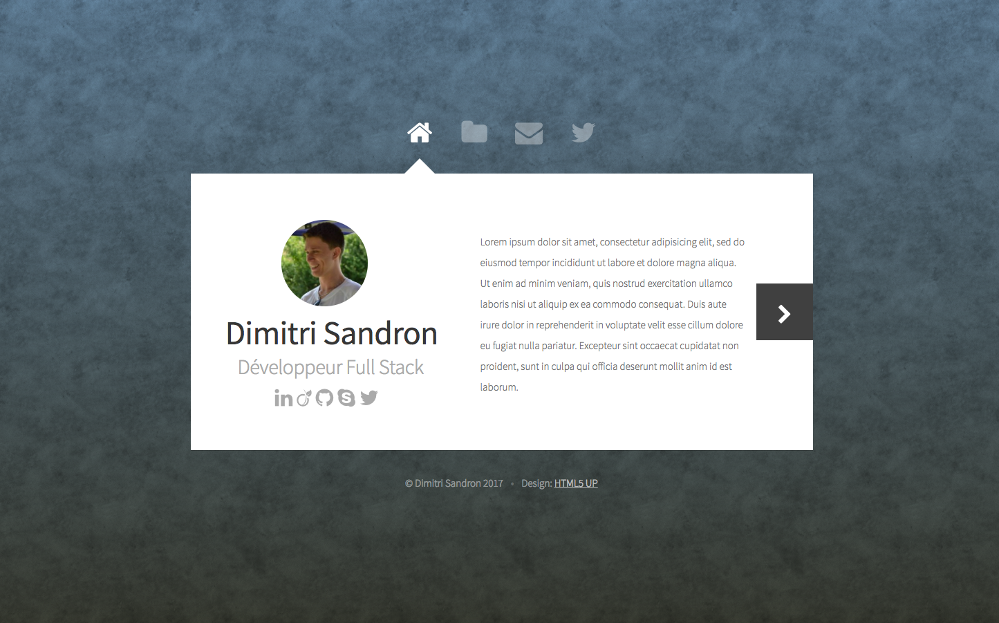

# Portolio
Nouveau portfolio fait en laravel. Front pour le site vitrine et back avec authentification pour la gestion desprojets, compétences, média, ...

## Requirements
- PHP 7.1 minimum
- Extensions de PHP7 mbstrinng, intl, ...

    `apt install --no-install-recommends php7.1 libapache2-mod-php7.1 php7.1-mysql php7.1-curl php7.1-json php7.1-gd php7.1-mcrypt php7.1-msgpack php7.1-memcached php7.1-intl php7.1-sqlite3 php7.1-gmp php7.1-geoip php7.1-mbstring php7.1-redis php7.1-xml php7.1-zip`
- `php7.1-sqlite`
- Composer

## Installation développement
1. Cloner le projet
2. Aller dans le dossier du projet
3. Faire un `composer install` pour installer tous les packages dont laravel
4. Créer fichier .env à la racine du projet à partir du fichier .env.example
5. Modifier la config de la database dans le fichier .env
```
DB_CONNECTION=sqlite
DB_DATABASE=database/database.sqlite
```
6 . Créer un fichier dans `database/data.sqlite`

7 . Lancer un serveur avec `php artisan serve`

8 . Lancer un `php artisan `


### Problèmes
- Installation PHP7.1 : https://tecadmin.net/install-php7-on-debian/
- https://www.noobunbox.net/serveur/auto-hebergement/installer-php-7-1-sous-debian-et-ubuntu/


## FRONT
- Affichage du portfolio à l'index du site http://dimitrisandron.fr



## Fonctionnalités
- Présentation de mon parcours
- Présentation de mes projets réalisés (avec liens GitHub)
- Formulaire de contact

## About
- Framework Laravel
- HTML, CSS, Javascript
- Thême HTML5 UP https://html5up.net/astral
- © **Dimitri Sandron** - _Mai 2017_

### Restants à faire
- Créer un projet laravel
- Inclure le contenu du dossier du theme dans le projet Laravel
- Trouver un theme backoffice
- Créer système authentification pour administration
- Modéliser base de données
- Créer tous les onglets sur BO

#### FO :
✓ Changer le fond
- Page "A propos de moi"
	✓ Photo (en rond)
	- Présentation rapide
	- Liens réseaux sociaux entreprises
	- Parcours (presentation rapide, en gras dans un paragraphe)
- Page "Mes travaux"
	- Boucle foreach sur les projets
	- Détail à afficher dans un déroulement en dessous de l'image aperçu du projet (gérer ocpacités)

#### BO :
- Modification contenu page "A propos de moi" > Présentation + photo de profil
- Gestion des projets (ajouts, édition, suppression)
- Stockage des messages de contact
- Modification des autres infos du site (liens réseaux sociaux, ...)

### Améliorations possibles
n/a

### Liens utiles
- https://galactic.ink/bg/
- https://tympanus.net/
- http://preview.themeforest.net/item/jevelin-multipurpose-premium-responsive-wordpress-theme/full_screen_preview/14728833
- Thêmes design : http://collectui.com/challenges/admin-panel